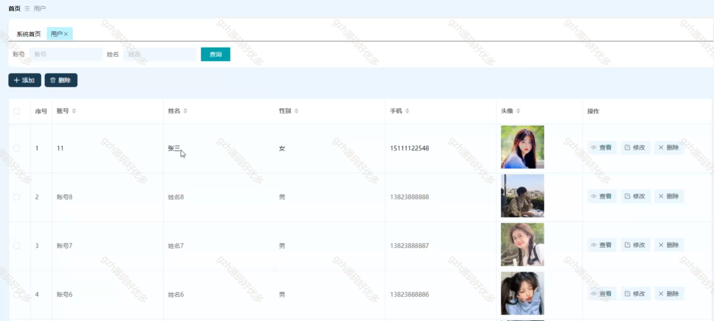

# python008
python008基于Python的协同过滤图书商城销售系统
 
## 查看主页获取源码

### 一、关键词

个性化推荐图书、热门图书推荐、图书商城、图书销售系统、书店

 

### 二、作品包含

源码+数据库+设计文档万字+PPT+全套环境和工具资源+部署教程

 

### 三、项目技术

前端技术：Html、Css、Js、Vue2.0、Element-ui
后端技术：Python3.7、Django2.0

  

 

### 四、运行环境（以下版本亲测，其他版本未知，请自测）

开发工具：PyCharm + VSCODE

数据库：MySQL5.7（最低要5.7版本）

数据库管理工具：Navicat10+

Python：Python3.7

前端Nodejs：14

浏览器：谷歌浏览器

 

### 五、项目介绍

项目编号：python008

儿童图书推荐系统是一种基于计算机技术和信息管理的系统，旨在帮助儿童图书爱好者。该系统通过整合儿童图书、热销图书等数据，提供全面的儿童图书管理服务

系统拥有管理员和用户两个角色，主要具备用户、图书分类、儿童图书、热销图书、公告信息、系统管理、订单管理、我的信息等功能

 

### 六、运行截图

